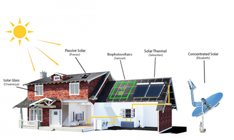

# Alternative Solar Technologies - Project Proposal

**Author**: Elizabeth John - CCDP2100 (Section C), Team 4, Alternate Solar Technologies

**Proposal Recipient**: Lisa Meyer - Linguistics & Language Studies 

**Project Client**: Melaine Abdelnour - Deep Blue Cleanup

**Date Submitted**: October 3, 2022

# 1.0 INTRODUCTION

I have written this proposal to receive approval for the team’s project.  The project my team will propose is on, ‘Alternative Solar Technologies’.  This topic will involve research on various types of solar technology, their real-world applications, as well as their implications.  The proposal will include background information on the significance of the proposed team’s project topic, the addressed problem, the solution, and the benefits to the client.  Consequently, section 3 I will discuss the team’s project topic and each member’s contribution to the project in section.  In section 4, I will conclude the proposal and the remaining appendices will be the Glossary and References pages.  The terms within the Glossary page will be classified in italics.

# 2.0	BACKGROUND ON ALTERNATE SOLAR TECHNOLOGIES 
The importance of our team’s project is that it will explore how each type of solar technology can help to improve the environment and the livelihood of others within everyday life.  Solar energy is a renewable form of energy due to the Sun’s radiation, which is harnessed for heat production or electricity generation [1]; tt is the world’s most replenishable energy source [3],  as it is enormously abundant and leads to zero pollution [1].  There are several environmental issues of which solar power can overcome.  The environmental problems our team is addressing are the emission of greenhouse gases and expensive infrastructure costs for energy harnessing. The client for our project is Melanie Abdelnour, an honorary member of the Deep Blue Cleanup.  This project will benefit our client by providing their blog education material to make youth more aware and knowledgeable of certain issues.

# 3.0	PROJECT DESCRIPTION
Figure 3.1 below provides a visual representation of our team’s project topic Alternative Solar Technologies.  This figure depicts the types of solar technologies the project will cover: solar glass, passive solar, bio-photovoltaics, solar thermal, and concentrated solar.  In this project, each member will thoroughly investigate a designated solar technology to answer the developed research question at hand.  Within the following subsections, I will break down the significance of each member’s subtopic.

**Figure 3.1: Solar energy subtopics [4]**

**3.1 Solar Glass**

For the subtopic on Solar Glass, Channasya will research the impact of surface texturing of glass upon energy production.  She will also explore the comparison between transparent solar glass and regular rooftop solar panels.  This subtopic will give insight into how effective solar glass can be as a material for construction.  Additionally, it will portray how solar glass will become a large step towards innovation within the field of solar technology.

**3.2 Passive Solar**

Here, for the subtopic on Passive Solar technology, Pranav will address the incorporation of passive solar energy production into each home design, as well as its use in every season.  This subtopic will discuss the benefits of this technology to those residing in certain areas with climate conditions specific to those regions.  Moreover, it may evaluate the performance of this technology within each season and whether it adjusts well to the overall structure of a home.  

**3.3 Bio-photovoltaic Cells**

Moving onto Bio-photovoltaic cells, Samuel will deduce the process of bio-photovoltaics and its benefits for others moving forward.  This subtopic will provide background on the integration of biological processes into solar technology and how that influences its interactions with the environment.  Furthermore, it will underline the renewable aspect of bio-photovoltaic cells concerning microorganisms and how both components collaborate to produce clean energy.

**3.4 Concentrated Solar**

Figure 3.2 below shows a diagram of a typical layout for concentrated solar power technology.

For my research question, I will investigate the impact of concentrated solar technology (CSP) on the energy mix of Canada.  I will answer this research question by exploring the applications of my given theory, Reflectivity, Absorptivity, and Transmissivity, to CSP. Reflectivity is the amount of reflected radiation per incident radiation; absorptivity is the quantity of absorbed radiation per incident radiation; transmissivity is the fraction of radiation transmitted over incident radiation [14].  This theory relates to CSP through the reflection, absorption, and transmission of light throughout the system [7].  Not to mention, I would investigate the implications of its applications to solar technology and how effective the technology would be overall.  This would then determine how this type of solar technology will impact the energy of Canada, where I would be able to compare it to other renewable forms of technology.  All in all, this engineering theory will be useful in evaluating the performance of CSP and its effect on the economy and livelihood in Canada.

# 4.0 CONCLUSION
In summary, I hope this project proposal will be accepted for my group to be able to move forward with the Alternative Solar Technologies project.  I am open to answering any questions or receiving feedback regarding this project and can be reached by the following email: _elizabethjohn@cmail.carleton.ca_.

# Glossary

***Bio-photovoltaics*** – a solar technology where light energy is converted into electrical energy through microorganisms involved in photosynthesis [6].  Photosynthesis is a process where light is converted into chemical energy by plants [9].  It is one of the solar technologies discussed in this project.
***Concentrated solar*** – a solar technology using mirrors to reflect and concentrate sunlight towards a certain point, converting it to heat.  The heat is then used to produce steam to power a turbine to generate electricity [7].  It is one of the main solar technologies covered in this project.
***Greenhouse gases*** – gases involved in absorbing and trapping heat in the air.  Some examples of greenhouse gases are carbon dioxide, methane, nitrous oxide, and water vapour [5].  Greenhouse gases are an environmental issue in which can be resolved by renewable energy alternatives such as solar power, as discussed in this proposal.
***Passive solar*** – a type of solar technology that transforms light energy into heat and allows the motion of air for building ventilation [15].  It is another type of solar technology explored by this project.
***Radiation*** – a form of energy that travels from any source throughout space at light speed [2].  It can also be known as electromagnetic waves [2].  Solar energy is an example of radiation emitted by the sun [1].
***Solar glass*** – a type of solar technology that acts as an alternative building material for building components such as rooves and windows; it simultaneously produces electricity when exposed to sunlight [8].  It is an additional solar technology this project will cover.
***Solar panel*** – a device used to harness sunlight to produce electricity or heat [10].  Solar panels are incorporated within energy processes that are specific to the alternative solar technologies covered in this project.
***Solar thermal*** – a type of solar technology that uses light energy to increase the temperature of a fluid with heat [11].  This is a final solar technology discussed in this project.
***Surface texturing*** – is a process involving the roughening of a surface to reduce reflection of the surface, improving the performance and efficiency of solar cells [12].  As stated in section 3, the subtopic on Solar Glass will explore the impact of this process upon the production of energy.
